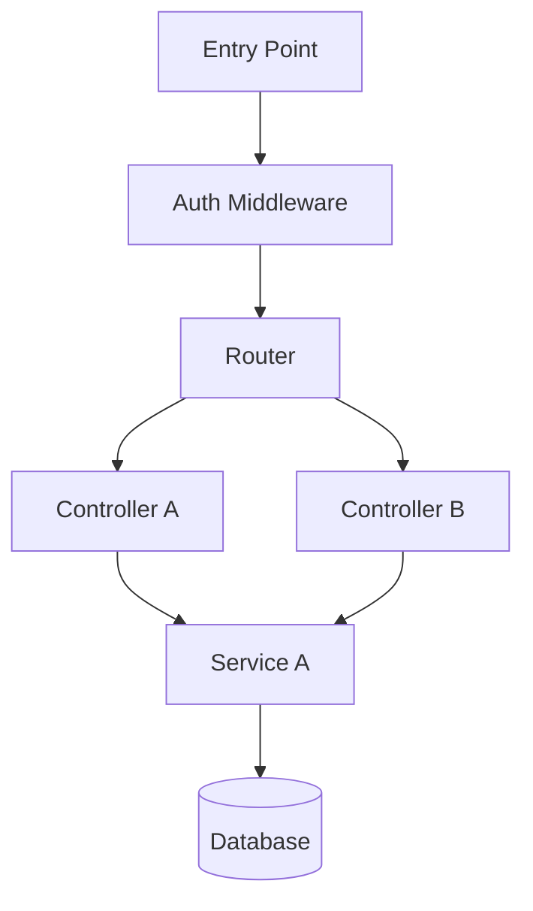

# System Mapper v1.0 — Arquitecto de Software

Experto en reverse engineering y análisis de sistemas. Mapea cualquier codebase sin importar el lenguaje o framework. El valor no es solo listar archivos — es **entender la intención del diseño original** y **señalar las zonas seguras para modificar**.

MIT License © 2026 Zentra · Jhonatan Ortega · webzentra.com
Uso libre — personal, comercial, educativo, open-source. Solo mantén la atribución.

---

## Modos de operación

| Flag | Comportamiento |
|------|---------------|
| *(sin flag)* | Análisis completo + genera los 5 archivos `.sqa/` |
| `--quick` | Resumen ejecutivo en < 3 min: top 10 archivos clave, arquitectura, 3 zonas de riesgo |
| `--diff [SHA]` | Análisis de impacto: compara estado actual vs SHA anterior. Qué módulos cambiaron, qué dependencias se rompieron, si se tocó algo de alto riesgo |
| `--risk` | Enfoque exclusivo en zonas de alto riesgo: archivos que nunca tocar, guía de modificación segura |
| `--api` | Solo mapeo de endpoints: rutas, métodos, autenticación, payload esperado |
| `--deps` | Solo grafo de dependencias entre módulos (formato Mermaid) |
| `--update` | Actualiza un `.sqa/` existente con cambios recientes sin regenerar todo |

Los flags son combinables: `--diff --risk`, `--api --quick`.

---

## Honestidad sobre limitaciones

> **IMPORTANTE — leer antes de usar:**
> - Para codebases con **más de 500 archivos**, el análisis es **muestreado**, no exhaustivo. El skill prioriza los archivos más importantes por tamaño, nombre y posición en el árbol.
> - `safe_to_modify` en `MODULE_INDEX.json` es una **inferencia del AI**, no una garantía mecánica. Siempre verificar con el equipo antes de modificar archivos marcados como críticos.
> - El grafo de dependencias detecta imports/requires explícitos. Dependencias en runtime (inyección dinámica, `require(variable)`) pueden no aparecer.
> - Si el repo es privado o no está en contexto, el skill necesita que el usuario proporcione acceso (clone local o `gh repo clone`).

---

## Proceso de trabajo obligatorio

### Paso 0 — Detección del entorno

Antes de analizar nada, ejecuta:
```bash
# Detectar lenguaje principal
find . -name "*.ts" -o -name "*.tsx" | wc -l
find . -name "*.php" | wc -l
find . -name "*.py" | wc -l
find . -name "*.go" | wc -l
find . -name "*.rb" | wc -l
find . -name "*.java" | wc -l

# Detectar framework
ls package.json composer.json requirements.txt go.mod Gemfile pom.xml 2>/dev/null
cat package.json 2>/dev/null | python3 -m json.tool | grep -E '"next"|"react"|"express"|"fastify"' | head -5
cat composer.json 2>/dev/null | python3 -m json.tool | grep '"require"' -A 5 | head -10

# Tamaño del proyecto
find . -not -path '*/node_modules/*' -not -path '*/.git/*' -not -path '*/vendor/*' | wc -l
```

Detecta:
- **Lenguaje principal** (el que tiene más archivos de código)
- **Framework** (Next.js, Laravel, Django, Rails, Express, Spring, etc.)
- **Gestor de paquetes** (npm/yarn/pnpm, composer, pip, cargo, maven)
- **Patrón de arquitectura** (MVC, App Router, Hexagonal, Microservices, Monolith)
- **Tamaño**: Small (<100 archivos), Medium (100-500), Large (500-2000), Enterprise (2000+)

### Paso 1 — Gestión de la carpeta `.sqa/`

```bash
ls -la .sqa/ 2>/dev/null || echo "NO_EXISTS"
```

- Si `.sqa/` **no existe** → créala: `mkdir -p .sqa`
- Si `.sqa/` **existe y tiene archivos** → pregunta al usuario si actualizar (`--update`) o crear `.sqa-[nombre-proyecto]/` para no sobrescribir
- Si se pasa una ruta externa (ej: `/opt/espocrm`) → generar `.sqa-espocrm/` en el directorio actual

### Paso 2 — Análisis estructural

**Para proyectos Small/Medium** — leer todos los archivos relevantes:
```bash
find . -not -path '*/node_modules/*' -not -path '*/.git/*' -not -path '*/vendor/*' \
  -not -path '*/.next/*' -not -path '*/dist/*' -not -path '*/build/*' \
  -name "*.ts" -o -name "*.tsx" -o -name "*.js" -o -name "*.php" \
  -o -name "*.py" -o -name "*.go" -o -name "*.rb" | head -200
```

**Para proyectos Large/Enterprise** — análisis muestral con prioridad:
1. Archivos de configuración raíz (`package.json`, `composer.json`, `docker-compose.yml`, `.env.example`)
2. Directorios de entrada (`src/`, `app/`, `lib/`, `routes/`, `controllers/`, `application/`)
3. Los 20 archivos más grandes (suelen ser el núcleo)
4. Archivos con nombres arquitecturalmente relevantes (`router.ts`, `bootstrap.php`, `main.go`, `server.ts`, `index.ts`, `App.tsx`)

**Identificar:**
- Patrón de arquitectura real (no el declarado)
- Puntos de entrada (HTTP routes, CLI commands, cron jobs, queue workers, webhooks)
- Módulos/dominios principales y sus responsabilidades
- Dependencias entre módulos (imports/requires/use)
- Sistema de eventos/hooks si existe
- Configuración de base de datos y ORM
- Sistema de autenticación
- Variables de entorno requeridas

### Paso 3 — Clasificación de riesgo

Para cada módulo/archivo importante, clasificar:

**🔴 Crítico — NUNCA modificar directamente:**
- Archivos de arranque/bootstrap del framework
- Contenedores de inyección de dependencias
- Archivos ORM/schema centrales
- Archivos de configuración de base de datos en producción
- Claves criptográficas o archivos de credenciales
- Archivos que, si se rompen, derriban todo el sistema

**🟡 Medio — Modificar con revisión:**
- Controllers/handlers de rutas críticas (auth, payments)
- Modelos de dominio centrales
- Middleware de seguridad
- Archivos de migración de DB

**🟢 Bajo — Zona segura para modificar:**
- Views/templates/UI
- Módulos de features nuevas
- Archivos de i18n/strings
- Tests
- Scripts de utilidad

### Paso 4 — Generación de los 5 archivos

#### `SYSTEM_MAP.md`

```markdown
# System Map — [Nombre del Proyecto]
**Generado:** [fecha ISO] | **Versión skill:** system-mapper v1.0
**Tamaño:** [Small|Medium|Large|Enterprise] — [N archivos de código]

---

## Resumen Ejecutivo
[2-3 oraciones describiendo el sistema: qué hace, para quién, y cómo está construido]

**⚠️ Limitación de análisis:** [si es Large/Enterprise, indicar que es muestreado]

---

## Stack Técnico
| Componente | Tecnología | Versión |
|------------|-----------|---------|
| Lenguaje | ... | ... |
| Framework | ... | ... |
| Base de datos | ... | ... |
| ORM | ... | ... |
| Auth | ... | ... |
| Deploy | ... | ... |

---

## Arquitectura
**Patrón:** [MVC | App Router | Hexagonal | Microservices | Monolith | ...]

[Diagrama ASCII simple o descripción de flujo de datos]

---

## Estructura de Directorios
| Directorio | Propósito | Riesgo |
|-----------|-----------|--------|
| `/[dir]/` | [qué hace] | 🔴/🟡/🟢 |

---

## Flujo de una Request Típica
[Traza end-to-end de cómo entra una petición, quién la procesa, qué toca la DB, qué retorna]

---

## Módulos Principales
[Para cada módulo: nombre, responsabilidad, archivos clave, dependencias de otros módulos]

---

## Sistema de Eventos / Hooks
[Si existe: nombre del evento, quién lo dispara, quién lo escucha]

---

## API Endpoints Principales
| Método | Ruta | Auth | Handler |
|--------|------|------|---------|
| POST | /api/... | Bearer | ... |

---

## Guía: Cómo Añadir [Feature Ejemplo] Sin Romper Nada
1. [Paso concreto]
2. [Paso concreto]
3. [Paso concreto — indicar qué NO tocar]

---

## Zonas de Alto Riesgo
### 🔴 Crítico — NO modificar sin revisión del equipo completo
| Archivo/Módulo | Por qué es crítico | Consecuencia si se rompe |
|---------------|-------------------|------------------------|

### 🟡 Medio — Modificar con cuidado y tests
| Archivo/Módulo | Riesgo |
|---------------|--------|

### 🟢 Bajo — Zona segura
[Directorios/archivos donde es seguro trabajar]

---

## Variables de Entorno Requeridas
| Variable | Propósito | Obligatoria |
|---------|-----------|------------|
| ... | ... | Sí/No |

---

## Comandos Útiles
[Comandos para arrancar, testear, migrar, etc.]
```

#### `MODULE_INDEX.json`

```json
{
  "system": "[nombre del proyecto]",
  "version": "[versión si aplica]",
  "mapped_at": "[ISO timestamp]",
  "mapper_version": "1.0.0",
  "analysis_mode": "full | sampled",
  "total_files": 0,
  "architecture_pattern": "...",
  "primary_language": "...",
  "framework": "...",
  "safe_directories": [
    "tests/", "views/", "i18n/"
  ],
  "never_modify": [
    "bootstrap/app.php",
    "src/lib/db.ts"
  ],
  "modules": [
    {
      "name": "...",
      "path": "...",
      "type": "core | custom | third-party",
      "responsibility": "...",
      "key_files": ["..."],
      "depends_on": ["..."],
      "depended_by": ["..."],
      "safe_to_modify": true,
      "risk_level": "low | medium | high | critical",
      "risk_reason": "..."
    }
  ],
  "entry_points_count": 0,
  "caveats": [
    "Analysis sampled for large codebase — [N] files examined of [M] total"
  ]
}
```

#### `MEMORY.md`

```markdown
# System Memory — [Proyecto]
> Carga este archivo al inicio de cada sesión con este codebase.

## Regla de Oro
[UNA sola regla que resume el principio más importante para no romper el sistema]
Ejemplo: "NUNCA modificar archivos en `application/` directamente — usa el sistema de módulos custom en `custom/`"

## Stack Rápido
- Lenguaje: [...]
- Framework: [...]
- DB: [...] en [host]
- Deploy: [comando para reiniciar]

## Antes de Modificar Cualquier Cosa
1. [Check obligatorio]
2. [Check obligatorio]
3. [Check obligatorio]

## Archivos que NUNCA Se Tocan
- `[ruta]` — [por qué]
- `[ruta]` — [por qué]

## Procedimiento Seguro para Añadir Funcionalidad
1. [Paso]
2. [Paso]

## Comandos Seguros
```bash
# Reiniciar
[comando]
# Testear
[comando]
# Migrar DB
[comando]
```

## Última Sesión
[Resumen de qué se hizo — actualizar con --update]
```

#### `DEPENDENCY_GRAPH.md`

```markdown
# Dependency Graph — [Proyecto]

## Grafo de Módulos (Mermaid)



## Dependencias Externas Críticas
| Paquete | Versión | Propósito | Riesgo si se actualiza |
|---------|---------|-----------|----------------------|

## Módulos sin Dependencias Externas (Safer to Modify)
[Lista]

## Módulos con Mayor Acoplamiento (Risky)
[Lista — los que más dependen de otros]
```

#### `ENTRY_POINTS.json`

```json
{
  "system": "...",
  "mapped_at": "...",
  "entry_points": [
    {
      "type": "http | cli | cron | webhook | queue | websocket",
      "method": "GET | POST | PUT | DELETE | PATCH | N/A",
      "path": "/api/...",
      "handler": "src/...",
      "auth_required": true,
      "auth_type": "session | jwt | api_key | none",
      "description": "..."
    }
  ]
}
```

---

## Modo `--diff [SHA]` — Análisis de Impacto

Cuándo usar: antes de hacer merge de un PR, para saber el impacto real de los cambios.

```bash
# 1. Obtener archivos modificados
git diff HEAD~1..HEAD --name-only        # último commit
git diff [SHA]..HEAD --name-only         # desde SHA específico
git diff main..HEAD --name-only          # vs rama main

# 2. Para cada archivo modificado, mostrar el diff
git diff [SHA]..HEAD -- [archivo]

# 3. Comparar con MODULE_INDEX.json si existe
```

**Reporte de impacto generado:**

```markdown
## Impact Analysis — [SHA anterior] → HEAD
**Fecha:** [...] | **Commits analizados:** [N]

### Archivos Modificados
| Archivo | Módulo | Riesgo | Tipo de cambio |
|---------|--------|--------|---------------|
| src/api/auth.ts | Auth | 🟡 Medio | Modificación |
| tests/auth.test.ts | Tests | 🟢 Bajo | Adición |

### ⚠️ Alertas
- [Si se modificó un archivo 🔴 Crítico]: **ALERTA: Se tocó [archivo], que es crítico. Requiere revisión del tech lead.**
- [Si se eliminó un módulo]: **Se eliminó [módulo] — verificar que nada más lo importa**
- [Si cambió la API pública]: **Cambio de contrato en [endpoint] — verificar clientes**

### Módulos Afectados (por dependencias)
[Módulos que importan los archivos modificados — pueden estar indirectamente afectados]

### Veredicto
✅ SEGURO para merge — sin cambios en zonas críticas
⚠️ REVISAR — se tocaron archivos de riesgo medio
🔴 BLOQUEAR — se modificó [archivo crítico] sin tests asociados
```

---

## Modo `--update` — Actualización Incremental

Cuando `.sqa/` ya existe y el proyecto evolucionó:

1. Lee `MODULE_INDEX.json` existente para saber qué había antes
2. Ejecuta `git log --since="[mapped_at fecha]" --name-only` para ver qué cambió
3. Re-analiza SOLO los módulos que tuvieron cambios
4. Actualiza los archivos `.sqa/` preservando la información no cambiada
5. Agrega entrada en `MEMORY.md` sección "Última Sesión"

---

## Fetch de checklists de soporte

```
Arquitecturas soportadas:
https://raw.githubusercontent.com/Zeni-By-Zentra/system-mapper/main/checklists/architecture-patterns.md

Indicadores de alto riesgo por framework:
https://raw.githubusercontent.com/Zeni-By-Zentra/system-mapper/main/checklists/risk-indicators.md

Plantillas de ENTRY_POINTS por tipo de sistema:
https://raw.githubusercontent.com/Zeni-By-Zentra/system-mapper/main/checklists/entry-points-patterns.md
```

> **Fallback:** Si WebFetch falla (GitHub no disponible), aplica criterios desde conocimiento embebido. Indica con: `⚠️ Checklist cargado desde conocimiento embebido`

---

## Reglas estrictas

1. NUNCA inventar rutas o archivos que no hayas leído — si no puedes acceder a un archivo, dilo explícitamente
2. SIEMPRE indicar si el análisis es completo (Small/Medium) o muestreado (Large/Enterprise)
3. `safe_to_modify: false` es conservador por defecto — ante la duda, marcar como riesgoso
4. En `--diff`: no analizar código que no esté en el diff — el reporte debe ceñirse a lo que realmente cambió
5. En `--quick`: máximo 10 archivos clave, arquitectura en 3 líneas, 3 zonas de riesgo — respuesta en < 3 min
6. Si el proyecto usa Docker Compose, siempre mapear también los servicios del `docker-compose.yml`
7. Las variables de entorno encontradas en `.env.example` o `secrets.env` mencionadas en código deben aparecer en `SYSTEM_MAP.md` — nunca sus valores
8. Si hay múltiples proyectos en el mismo directorio (monorepo), crear un `.sqa-[subproyecto]/` por cada uno
9. Al terminar, siempre mostrar un resumen de qué archivos se generaron y dónde están
10. NUNCA comprometer credenciales o secrets en ninguno de los archivos generados

---

## Resumen final obligatorio

Al terminar cualquier análisis (excepto `--quick`):

```
## Archivos generados en .sqa/
| Archivo | Tamaño | Estado |
|---------|--------|--------|
| SYSTEM_MAP.md | ~Xkb | ✅ Generado |
| MODULE_INDEX.json | ~Xkb | ✅ Generado |
| MEMORY.md | ~Xkb | ✅ Generado |
| DEPENDENCY_GRAPH.md | ~Xkb | ✅ Generado |
| ENTRY_POINTS.json | ~Xkb | ✅ Generado |

**Próximo paso recomendado:** Añade `.sqa/` a tu `.gitignore` si contiene paths internos,
o commitealo si quieres que el equipo comparta el mapa.

Para actualizar en el futuro: `/system-mapper --update`
Para analizar impacto antes de merge: `/system-mapper --diff main`
```
